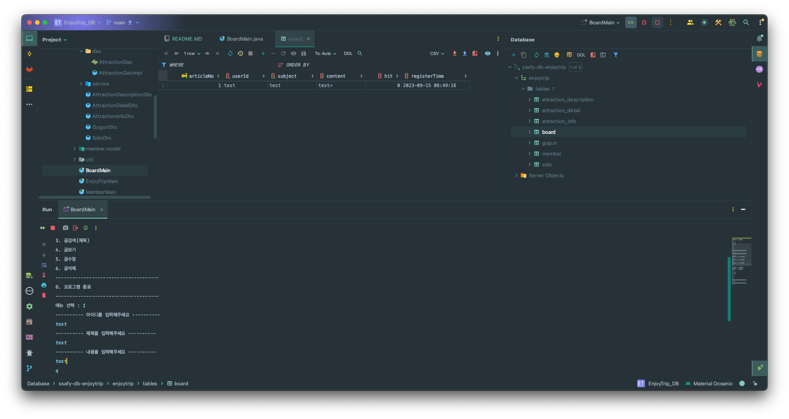

# Enjoy Trip!
## 16반 김연수 유현종
### Attraction
- 지역별,  컨텐츠 타입별 관광지 정보 검색 기능 구현

- 관광지명을 활용한 검색

---

### Member
- 회원가입 기능 구현

- 로그인 기능 구현 : 로그인을 하면 로그인 정보와 id를 변수로 저장하여 유지한다.

- 회원정보 수정 구현 : 먼저 로그인이 되어 있어야 하며, 로그인이 되어 있으면 변경할 비밀번호와 이름을 입력받아 수정한다.

- 회원탈퇴 구현

---

### Board
- 글등록 구현 : 아이디, 제목, 내용을 입력받아 저장한다. 내용의 경우 q를 입력하면 종료한다.

- 글목록 불러오기 구현

- 글제목으로 검색 구현

- 글보기 구현

- 글수정 구현

- 글삭제 구현
