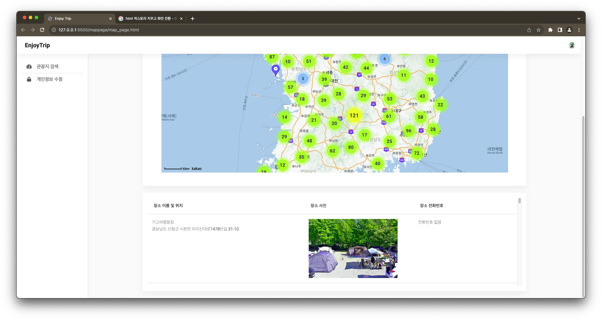

# Enjoy Trip!

## 16반 김연수 유현종

### 메인화면

- 총 3개의 사진이 자동으로 전환되는 메인 화면.
- 시작하기 버튼을 통해 로그인 화면으로 전환 가능.
- 로그인, 회원 가입 버튼을 통해 각각의 페이지로 이동 가능.
---
### 로그인 화면

- localStorage에 저장된 회원 정보를 기반으로 로그인.
- 로그인 하면 로그인 정보가 마찬가지로 localStorage에 남음.
- 로그인 정보를 기반으로 이미 로그인 되어 있는 경우 바로 관광 정보 확인 화면으로 전환.

- 비어있거나 잘못된 정보를 기입한 경우 alert발생
---
### 회원가입 화면

- 주어진 항목들을 모두 기입하면 회원 가입 가능.
- 회원 정보는 localStorage에 저장된다.
- 가입이 완료되면 로그인 화면으로 전환.
- 로그인화면과 마찬가지로 입력 폼에 빈 곳이 있거나, 유효하지 않은 메일을 입력했을 경우 alert
---
### 회원 정보 수정 화면

- 사용자 정보를 새롭게 입력하여 정보를 수정할 수 있다.
- 비밀번호를 다시 입력하여 탈퇴할 수 있다.
---
### 관광 정보 확인 화면

- 처음 들어오면 보이는 화면으로 시도, 시군구, 타입을 선택하여 조회할 수 있다.

- 원하는 카테고리 및 지역을 선택하여 관광정보를 얻을 수 있다.
- 원하는 클러스터를 선택하여 확대된 화면으로 확인할 수 있다.

- 마커를 클릭하면 사진과 장소이름, 주소를 확인할 수 있다.

- 지도 하단에는 검색으로 얻은 관광지 정보들을 리스트 형태로 확인할 수 있다.